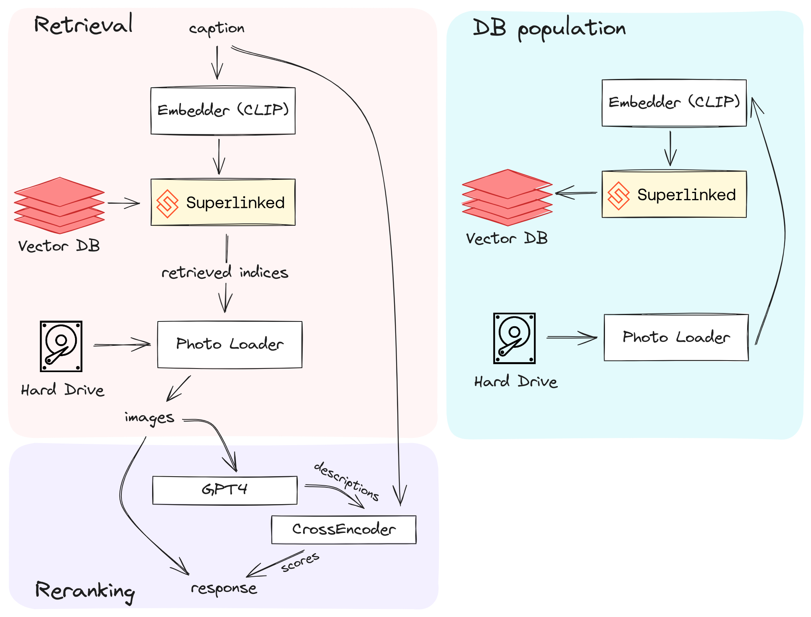
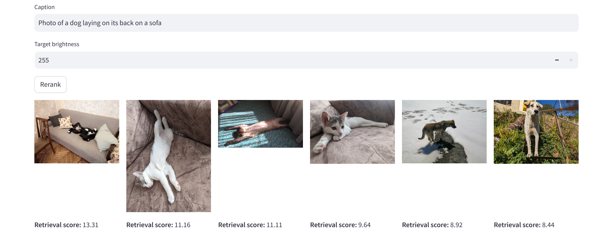
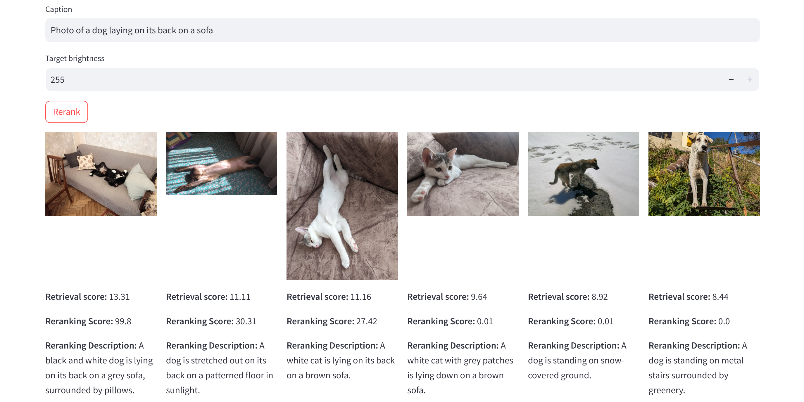

# Caption Match 🖼️

A simple application powered by [Superlinked](https://github.com/superlinked/superlinked) to search for images in your library based on caption and other parameters.

### Disclaimer 🚨

This project is an experimental exploration of Superlinked's capabilities.
The code is not optimized and has been tested with fewer than 100 personal photos.
Please, treat it as PoC.

### Ideation 💡

Searching for a specific image in a disorganized photo library can be challenging.
Often, users want to locate images using brief descriptions.
To address this, I've developed a tiny application that offers a straightforward interface for conducting such searches across a photo library stored on a hard drive.

### Approach 🛠️

**Storing and retrieval**
- [OpenAI CLIP](https://github.com/openai/CLIP) for embedding images and captions. CLIP is a powerful model that can understand and generate embeddings for both images and text in a unified manner. This allows to create a shared representation for images and their associated captions, enabling efficient and semantically meaningful retrieval.

- [Superlinked](https://github.com/superlinked/superlinked) for quick querying images by caption and other parameters. Superlinked is a versatile framework that provides out-of-the-box vector spaces, in-memory vector storage, and querying. This makes it an ideal choice for storing and retrieving image embeddings.

**Reranking**

- [OpenAI API](https://platform.openai.com/) for generating rich descriptions for images. While CLIP is fast and open-source, it alone may not suffice for building a high-performing retrieval system. Therefore, I employ the OpenAI API to generate more detailed and nuanced descriptions for candidate images, which aids in the reranking process.

- [SentenceTransformers](https://sbert.net) for a final reranking given original caption and automatically generated description for candidates by OpenAI GPT-4. SentenceTransformers allows to generate meaningful sentence embeddings, which I use to compare the original caption with the descriptions generated by GPT-4. This comparison helps to rerank the candidate images and select the most relevant ones.

**Other**
- [Streamlit](https://streamlit.io/) for creating a simple UI. Streamlit is a fast, user-friendly tool that allows to create a UI for our project. This makes it easier to tweak parameters and send queries, providing a more interactive and accessible way to use our image retrieval system.



### Setup and Run 🚀

1. Put your photos (`.png` and `.jpg`) in [`/data`](./data/) and update environmenta variable `DYNACONF_PHOTO_FOLDER` in [docker-compose.yaml](./docker-compose.yaml) if needed.
To use recency as a retrival parameter, be sure that your photos have exif info!
For a quick start, you can extract exemplary photos.zip.
1. Build docker image and run docker compose:

```shell
docker build -t caption-match-app .
docker compose up
# go to localhost:8501
```

### Example

**Retrieval**

Let's examine the images retrieved using the caption "Photo of a dog laying on its back on a sofa".



On this picture, "Retrieval score" is the inner product between caption and image embeddings.

- Image 1 is the most relevant.
- Images 2 and 3 are somewhat relevant, but they depict a cat instead of a dog.
- Image 4 shows a cat (not a dog) laying in a normal position (not on its back) on a sofa.
- Images 5 and 6 are photos of dogs, but they are not laying on their backs, and there is no sofa present.



Upon clicking the "Rerank" button, a call is made to OpenAI for the description, followed by the reranking process using CrossEncoder. "Reranking score" is a logits provided by the CrossEncoder with sigmoid applied at the end. The retrieval and reranking scores have different meanings and can't be compared directly.

Here are the reranked results:

- Image 1 remains the most relevant, which is excellent.
- Image 2 received the description "A *dog* is stretched out ...", indicating a misclassification of the animal. If this cat were a dog, it would be a great example of effective reranking.
- The remaining images retain their original positions.

While this specific example may not seem impressive, it demonstrates an importance of the *reranking score*. This score can be used to filter out completely irrelevant images, such as the last three in our case. These images received a reranking score of less than 0.1. The most relevant image got 99.8! However, the retrieval scores for all relevant and irrelevant cases are quite similar, ranging from 8.44 to 13.31.

### Notes 📝

- Retrieval often yields irrelevant photos that can be cought during reranking.
My reranking method generates descriptions and uses a CrossEncoder for scoring.
However, the non-deterministic nature of generated descriptions [source](https://platform.openai.com/docs/guides/text-generation/reproducible-outputs) poses a challenge for production.
Potential solutions include caching descriptions or deploying a dedicated model for reproducibility control.

- Initially, I queried photos by caption as well as by additional parameters: brightness and recency.
However, such approach faced problems.

  - While easy to add, parameters like brightness, dominant color, and saturation interfere with the caption during querying.
  The caption's weight becomes less impactful compared to brightness and recency.
  This could be due to the larger vector space for image embeddings and the potential overlap of these parameters with the caption content.

  - Reranking becomes complex with multiple parameters.

  - Possible solution is *phased retrieval* (I've just came up with this name). Later about that.

- Currently, data is loaded and processed at each startup.
Efficiency could be improved by storing embeddings in a persistent vector database for quick access upon restarts.

- As this is a proof-of-concept, tasks like model selection, quality evaluation (!), proper ETL, and others are pending.
These tasks are on the ToDo list.

**Phased retrieval**

Motivation

Consider a query that aims to retrieve images that are **both recently created and captioned** (for instance, "airplane landing in front of the sunset"). A high recency weight parameter may result in images that neither feature airplanes nor sunsets.

Proposed Solution:

Let N be the desired number of images to retrieve.

- Phase 1: Retrieve 10 x N images based on the caption.
- Phase 2: From these candidates, select the N most recent images.

### ToDo 📌

- [x] Dockerfile
- [x] poetry
- [x] Refactoring
- [ ] Evaluation!
  + [ ] Try different "CLIP" model like [SigLIP](https://huggingface.co/google/siglip-so400m-patch14-384), evaluate performance and pick best model
  + [ ] Same with desctription generator ([LLaVA](https://llava-vl.github.io/blog/2024-01-30-llava-next/))
  + [ ] Same with the CrossEncoder ([sbert](https://sbert.net/examples/training/cross-encoder/README.html))
- [ ] persistent vector DB
- [ ] docstrings
- [ ] logging
