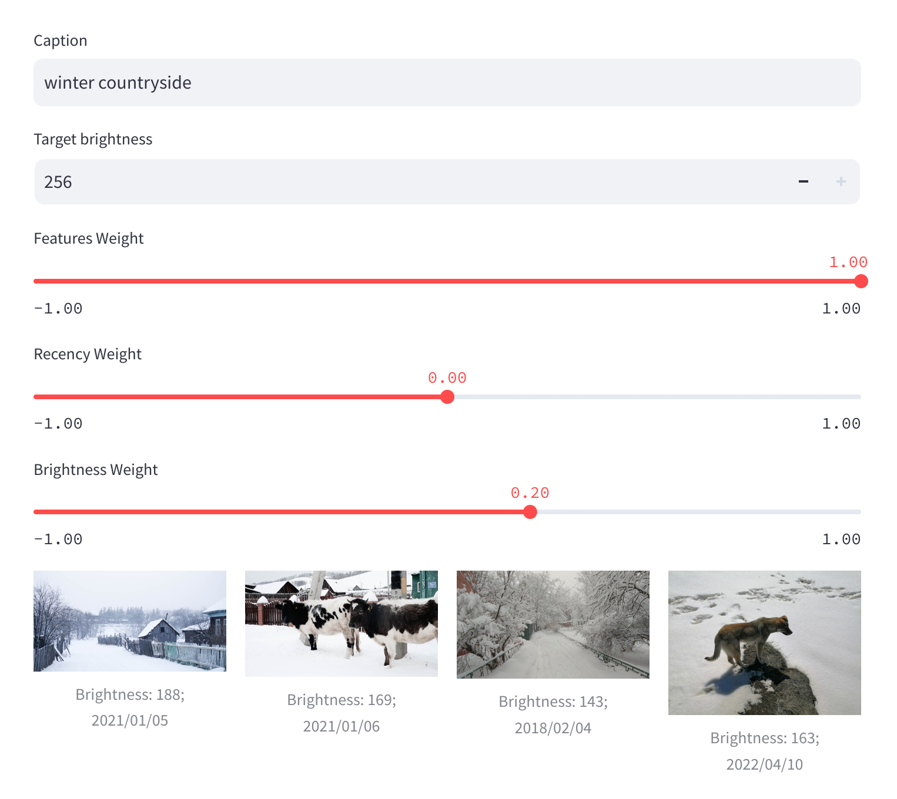

# Caption Match 🖼️

A simple application powered by [Superlinked](https://github.com/superlinked/superlinked) to search for images in your library based on caption, recency, and brightness.



### Disclaimer 🚨

This project is an experimental exploration of Superlinked's capabilities. The code is not optimized and has been tested with fewer than 100 personal photos.

### Ideation 💡

Popular messengers like Telegram and WhatsApp lack the ability to search for images by captions or specific parameters. This project addresses that by integrating:

- [OpenAI CLIP](https://github.com/openai/CLIP) for embedding images and captions.
- [Superlinked](https://github.com/superlinked/superlinked) for querying images by caption and other parameters.
- [Streamlit](https://streamlit.io/) for creating a simple UI.

### Setup and Run 🚀

1. Put your images (`.png` and `.jpg`) in [`/data`](./data/) and update environmenta variable `DYNACONF_PHOTO_FOLDER` in [docker-compose.yaml](./docker-compose.yaml) if needed. Be sure that your images have exif info!
1. Build docker image and run docker compose:

```shell
docker build -t caption-match-app .
docker compose up
# go to localhost:8501
```

### Notes 📝

- Results sometimes include irrelevant images, so it would be beneficial to re-rank them.

- It is easy to add more parameters, like dominant color, saturation. However, they may negatively interfere with caption during the querying (see next).

- The **weight** assigned to the caption parameter is significantly less impactful compared to brightness and recency. Adjusting the recency weight to around 0.05 can effectively negate the influence of the caption. This behavior may be due to two factors:

  - The vector space for image embeddings is substantially larger than that for brightness and recency, and subjected to curse of dimensionality.
  - Brightness (or similarly, saturation or main color) might also be described in the caption, such as in phrases like "dark winter forest" or "shiny coastline".

- Currently, data is loaded and processed at each startup. To improve efficiency, embeddings can be stored in a **persistent vector database** that can be quickly accessed upon application restarts.

### ToDo 📌

- [x] Dockerfile
- [x] poetry
- [x] Refactoring
- [ ] Try different "CLIP" model like [SigLIP](https://huggingface.co/google/siglip-so400m-patch14-384)
- [ ] Redis as a vector DB
